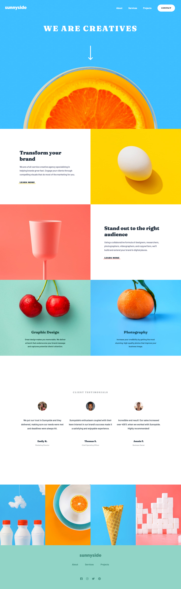
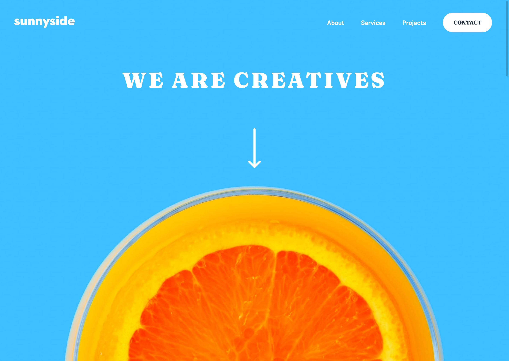

# Frontend Mentor - Sunnyside agency landing page solution

This is a solution to the [Sunnyside agency landing page challenge on Frontend Mentor](https://www.frontendmentor.io/challenges/sunnyside-agency-landing-page-7yVs3B6ef). Frontend Mentor challenges help you improve your coding skills by building realistic projects.

## Table of contents

- [Overview](#overview)
  - [The challenge](#the-challenge)
  - [Screenshot](#screenshot)
  - [Links](#links)
- [My process](#my-process)
  - [Built with](#built-with)
  - [What I learned](#what-i-learned)
  - [Useful resources](#useful-resources)
- [Author](#author)

## Overview

### The challenge

Users should be able to:

- View the optimal layout for the site depending on their device's screen size
- See hover states for all interactive elements on the page

### Screenshot

### Links

- Solution URL: [frontendmentor.io](https://www.frontendmentor.io/solutions/sunnyside-agency-lp-solution-scss-js-semantic-html-bem-fun-Dy6SvLBne)
- Live Site URL: [https://ericsalvi.github.io/sunnyside-agency-landing-page-solution/](https://ericsalvi.github.io/sunnyside-agency-landing-page-solution/)

## My process

### Built with

- Semantic HTML5 markup
- SCSS
- Flexbox
- Mobile-first workflow
- Visual Studio Code
- axe DevTools for accessibility

### What I learned

I never needed to keep background images aspect ratio the same size. For this design it was needed since the design is driven by the images and exact placement of content. A little research led me to a really nice article on how to do this using padding-top and some math within CSS.

### Useful resources

- [Aspect Ratio Boxes](https://css-tricks.com/aspect-ratio-boxes/) - This is the math needed to keep my iamaes in my boxes aspect ratio the same.
- [Hamburger Menu](https://codepen.io/husnimun/pen/pJvEeL) - This is the inspiration for the hamburger menu.

## Author

- Website - [Eric Salvi](https://github.com/ericsalvi)
- Frontend Mentor - [@ericsalvi](https://www.frontendmentor.io/profile/ericsalvi)
